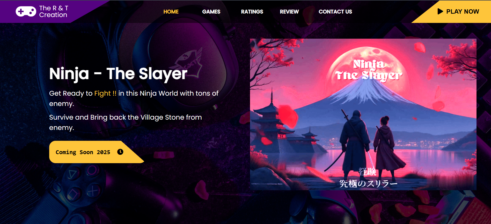
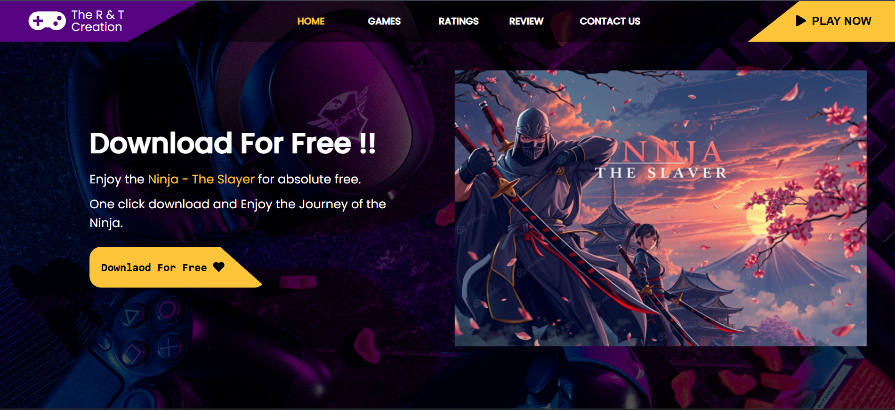
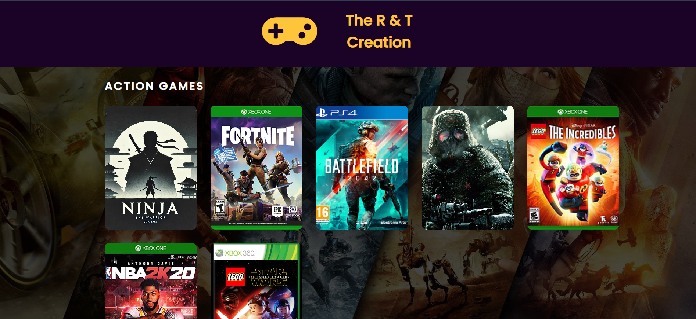
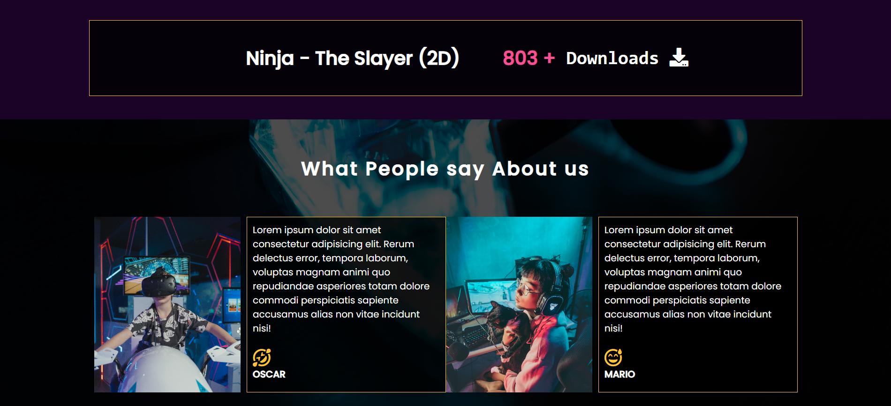

# 🕹️ RT Creation | Game Launch Platform

A Django-based platform to distribute, update, and manage feedback for the 2D Java desktop game **“Ninja The Slayer”** — designed and developed by **Tirth Gajera**.

## 🔗 Live Demo

🌐 [Visit Website](https://rtcreation.onrender.com/)  

---

## 📦 What is RT Creation?

**RT Creation** is a clean, functional platform built to host and launch the game *Ninja The Slayer*. It allows users to:

- 📥 Download the game as a Windows executable (.exe)
- 🆕 Stay informed about updates and patch notes
- 📝 Submit reviews and feedback
- 📩 Contact the developer directly

---

## 🚀 Features

- ✅ Game installer download link
- 🧾 Patch notes
- 📨 Contact form
- ⭐ User review system

---

## 🧰 Tech Stack

| Layer        | Tech             |
|--------------|------------------|
| Frontend     | HTML, CSS, JS    |
| Backend      | Python, Django   |
| Database     | SQLite           |
| Deployment   | Render           |
| Game Package | Inno Setup       |

---

## 🖼️ Screenshots

| Home Page | Download Section | Contact Page |
|-----------|------------------|--------------|
|  |  |  |

---

## 👤 Author

Made with 💻 by **[Tirth Gajera]**

---

## 📜 License

[MIT License](LICENSE)

---

## 🙌 Feedback / Support

If you enjoy the game or the platform, feel free to leave a review or contact the developer for feedback or issues.

---
